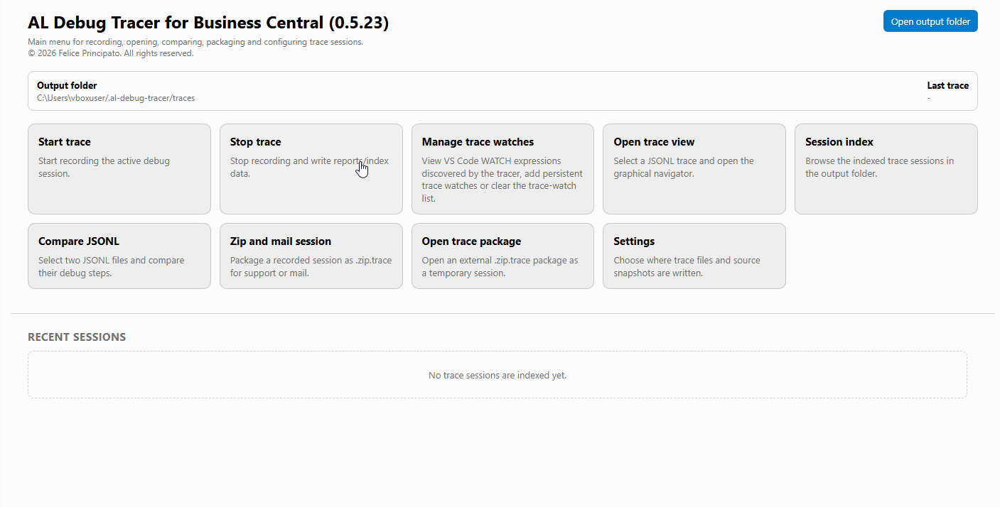
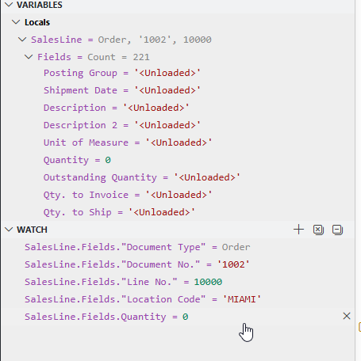
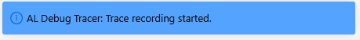
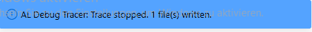
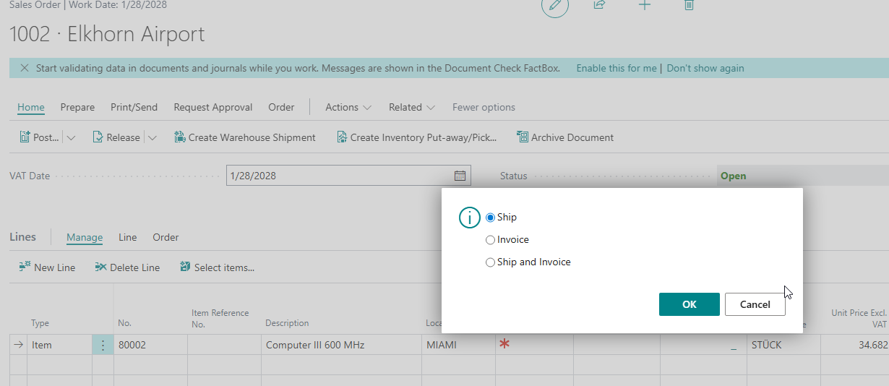
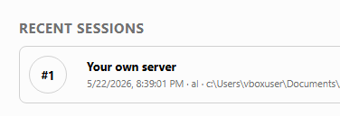
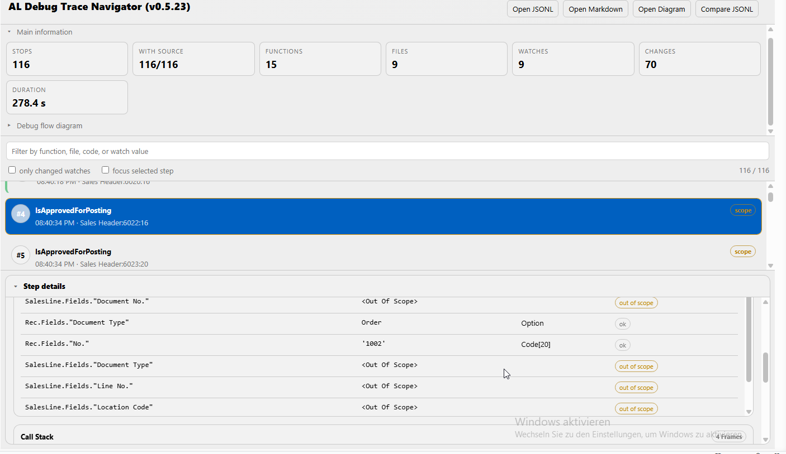

# AL Debug Tracer

Advanced debugging and trace navigation for Microsoft Dynamics 365 Business Central and AL development.

This repository is the public support and documentation repository for the AL Debug Tracer extension.
The extension source code itself is intentionally kept private.

---

## Features

- Advanced AL trace visualization
- Trace navigation support
- Session and execution inspection
- Watch tracking and comparison
- Trace packaging and session replay
- Lightweight VS Code integration
- Optimized workflows for AL developers

---

## Trace Navigator

Interactive trace navigation with detailed step inspection and scope visualization.

---

## Watch Tracking

Inspect and compare watched values during debugging sessions.

---

## Trace Workflow

Start and stop trace recording directly from VS Code.

### Start Trace

### Stop Trace

---

## Business Scenario Example

Example workflow while processing a Business Central sales order.

---

## Session Index

Browse previously recorded sessions directly from the extension.

---

## Trace Result Overview

Open and inspect generated trace sessions.

---

## Installation

Install the extension directly from the Visual Studio Code Marketplace.

---

## Issues & Feedback

Please report bugs or feature requests via the GitHub issue tracker:

https://github.com/FelicePrincipato/al-debug-tracer-support/issues

---

## Privacy & Source Code

This repository intentionally does not contain the extension source code.

The public repository is used exclusively for:

- documentation
- screenshots
- issue tracking
- changelog publication
- marketplace support resources

---

## Changelog

See [CHANGELOG.md](CHANGELOG.md)
